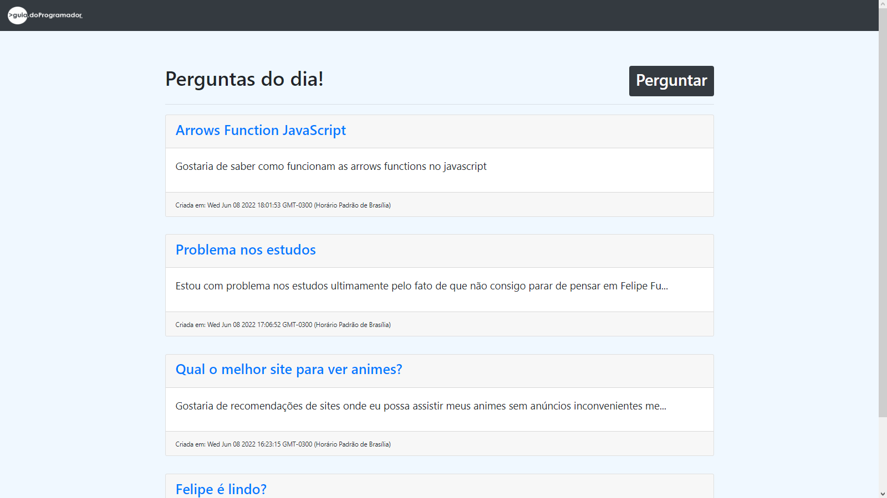
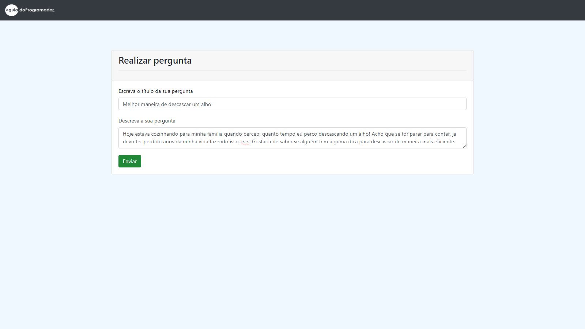
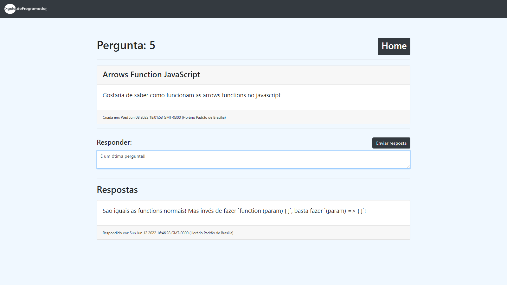

# [GuiaPerguntas](http://137.184.100.34) 🔗
⬆⬆⬆ [Site de perguntas e respostas](http://137.184.100.34) criado durante o curso de Node.js do Guia do Programador    
O site vai estar rodando até o dia 10/07 em um droplet do [DigitalOcean](https://cloud.digitalocean.com/)!    

## ⭐ Projeto Concluído (Passivo de futuras atualizações) ⭐

## Tencologias usadas 👾


- Node.js
- Javascript
- Bootstrap
- MySQL

## Funcionalidades 📌
- [x] Cadastro de perguntas
- [x] Cadastro de respostas
- [x] Listagem das perguntas
- [ ] Busca de perguntas
- [ ] Edição de perguntas e respostas
- [ ] Exclusão de perguntas e respostas

## Páginas 🚢
    
    
    


### Pré-requisitos

Antes de começar, você vai precisar ter instalado em sua máquina as seguintes ferramentas: [Node.js](https://nodejs.org/en/). 
Além disto é bom ter um editor para trabalhar com o código como [VSCode](https://code.visualstudio.com/)

### 🎲 Rodando o Back End (servidor)

```bash
# Clone este repositório
$ git clone <https://github.com/Fuckners/GuiaPerguntas>

# Acesse a pasta do projeto no terminal/cmd
$ cd guiaperguntas

# Acesse a pasta databases
$ cd databases

# Abra o arquivo database.js
$ nano database.js

# Edite a senha (12345678) para a sua senha do mysql

# Salve as alterações usando Ctrl + X

# Volte para a pasta principal
$ cd ../

# Instale as dependências
$ npm install

# Execute a aplicação
$ node server.js

# Caso dê erro, abra o mysql
$ mysql

# E use o seguinte comando:
$ ALTER USER 'root'@'localhost' IDENTIFIED WITH mysql_native_password BY 'minhasenha';

# O servidor inciará na porta:8080 - acesse <http://localhost:8080>

# Faça o máximo de perguntas que puder!
```

### Autor
<a href="https://blog.rocketseat.com.br/author/thiago/">
 
 <br>
 <sub><b>Felipe Fuckner Clariano</b></sub></a>
 
 Entre em contato! 💌
 
[](https://www.linkedin.com/in/felipe-fuckner-b65a49237) 
[](mailto:felipefclariano04@gmail.com)
